# Age of View

Multiagent-Difference-Reward-based-deep-reinforcement-learning-with-a-Greedy-Bandwidth-Allocation (MDR-GBA)

## Silde

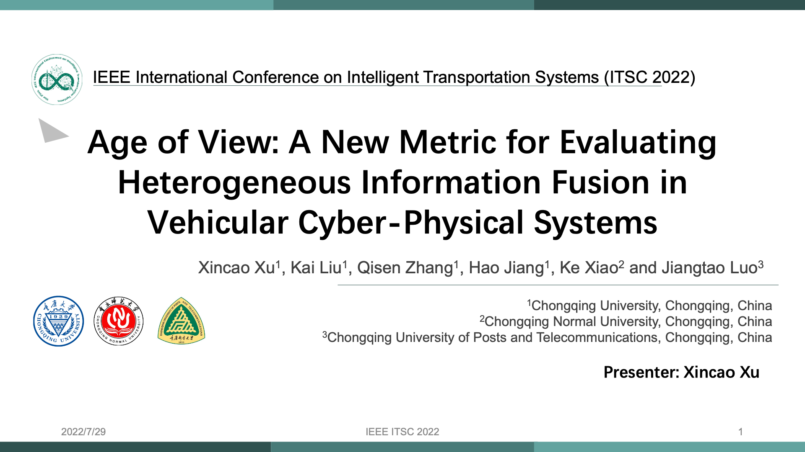

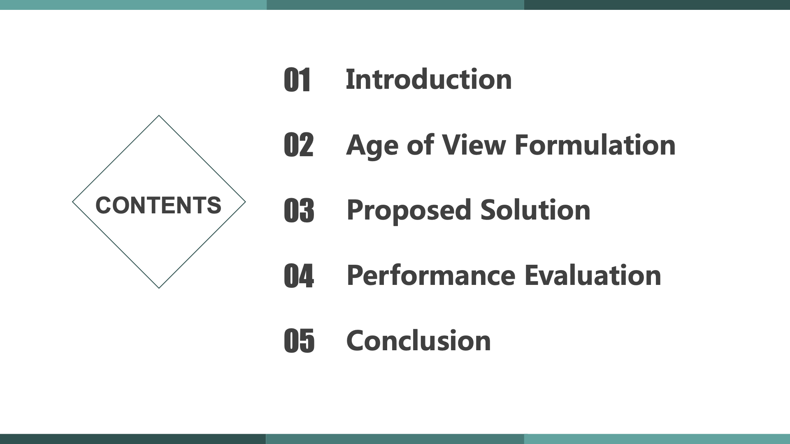

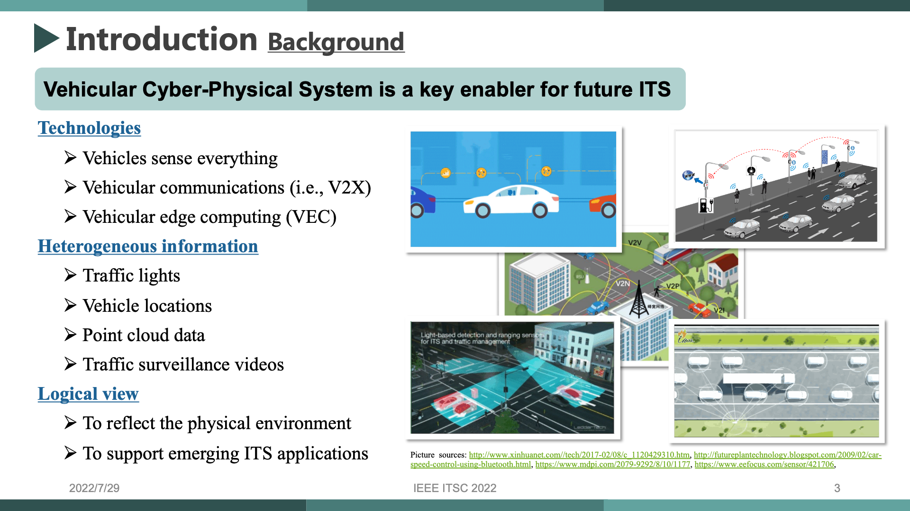

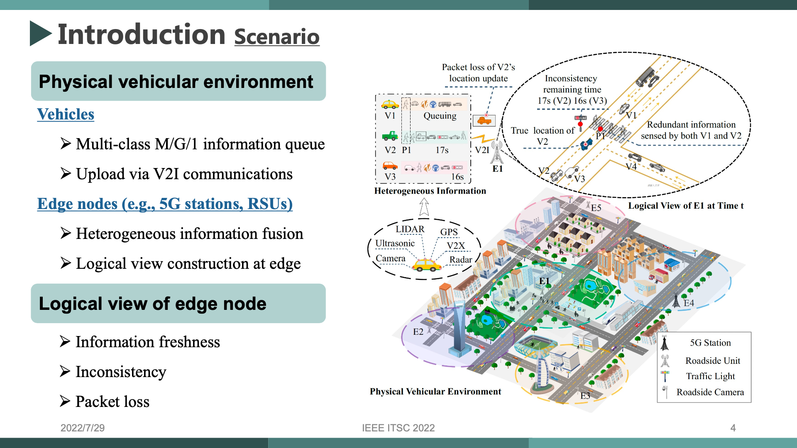

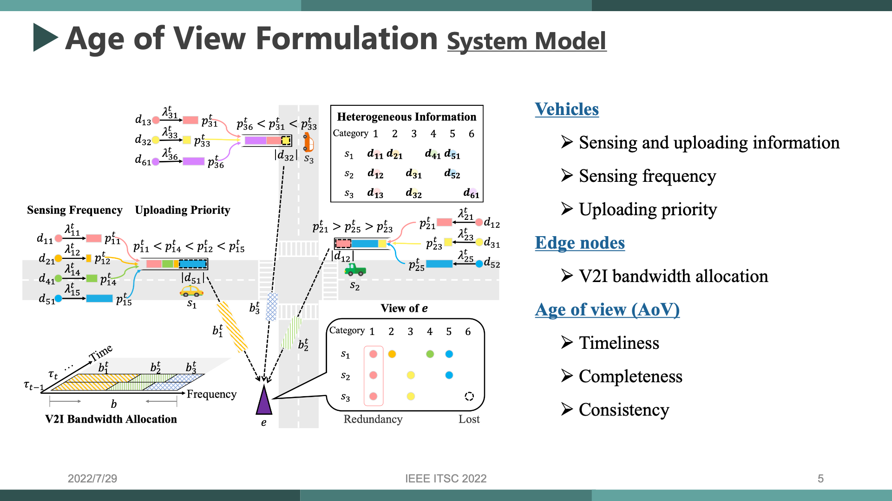

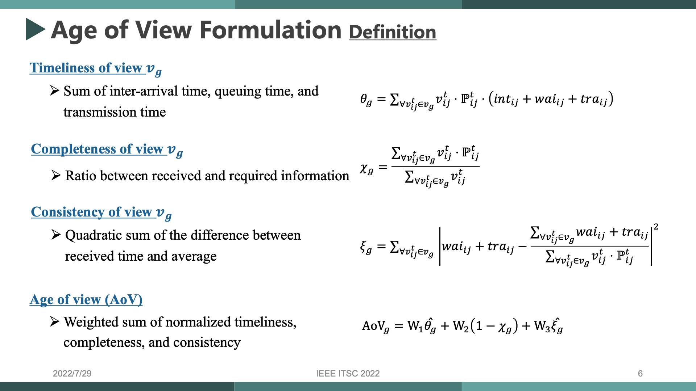

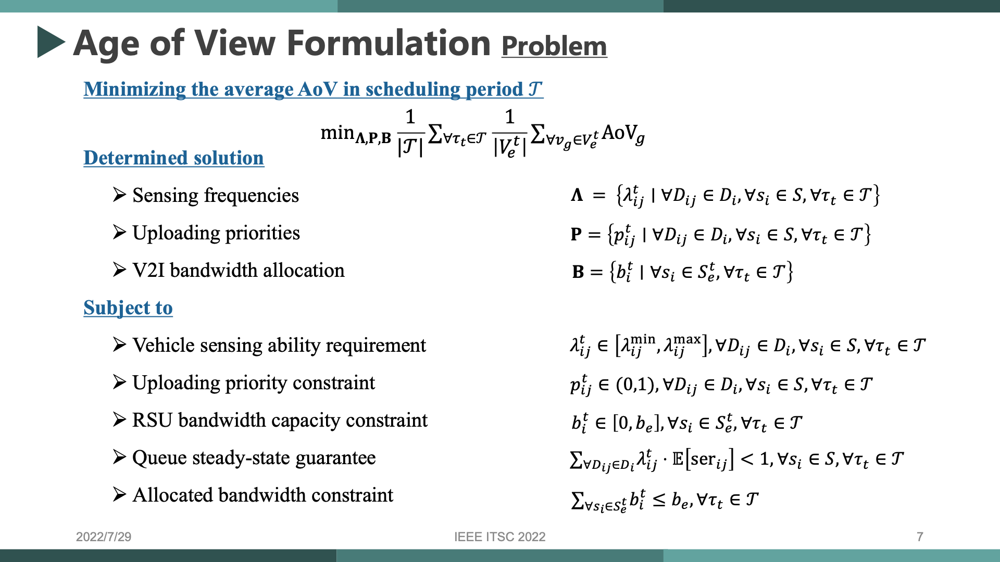

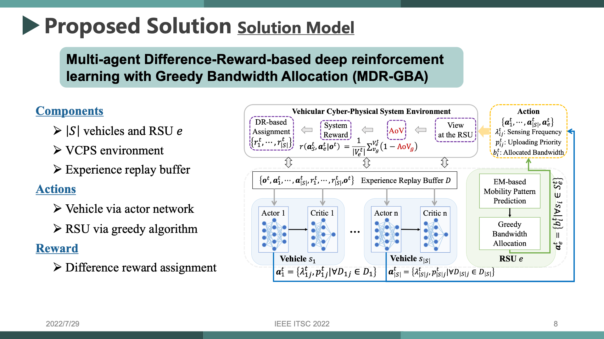

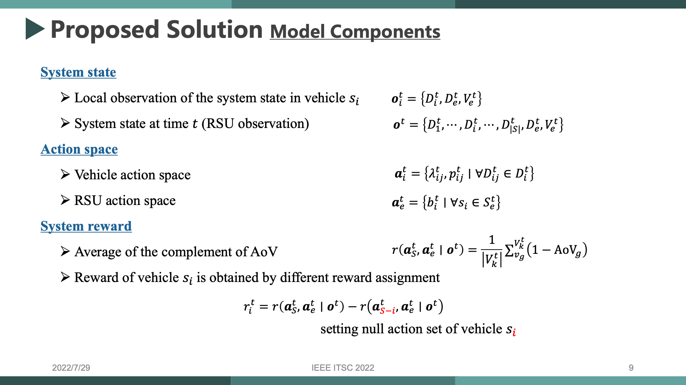

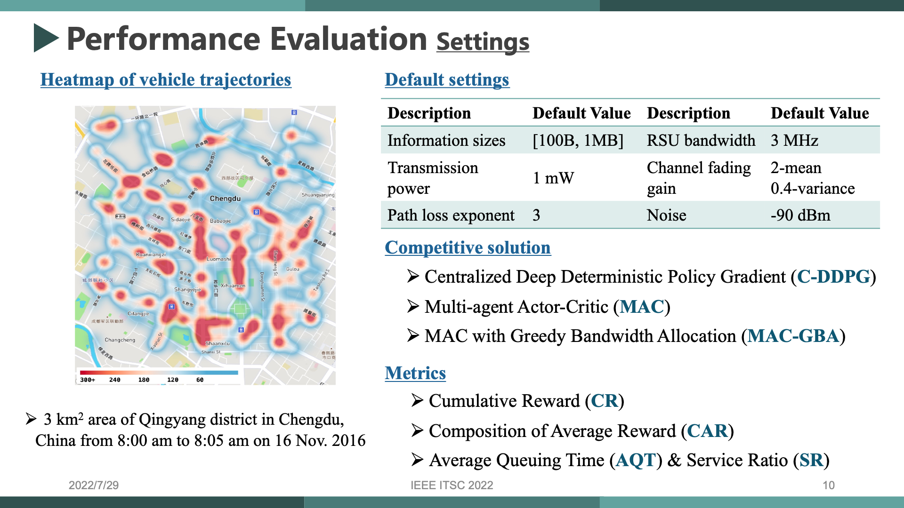

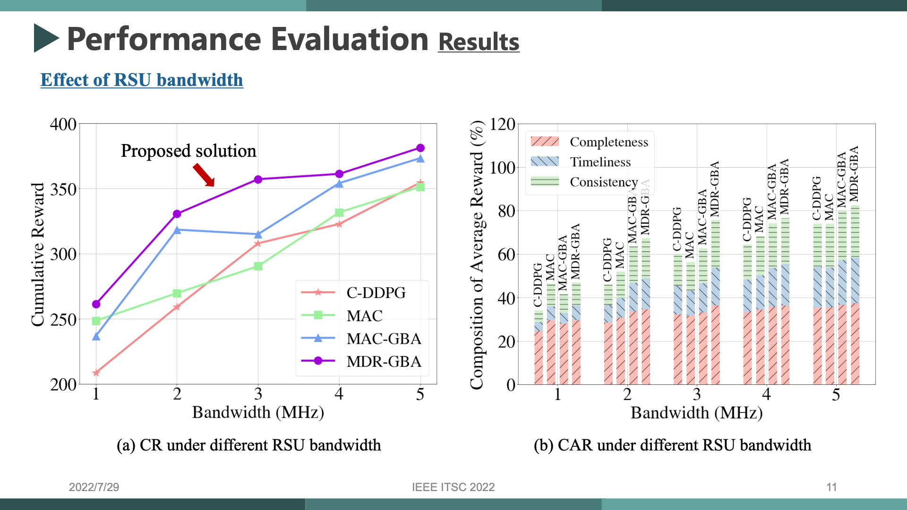

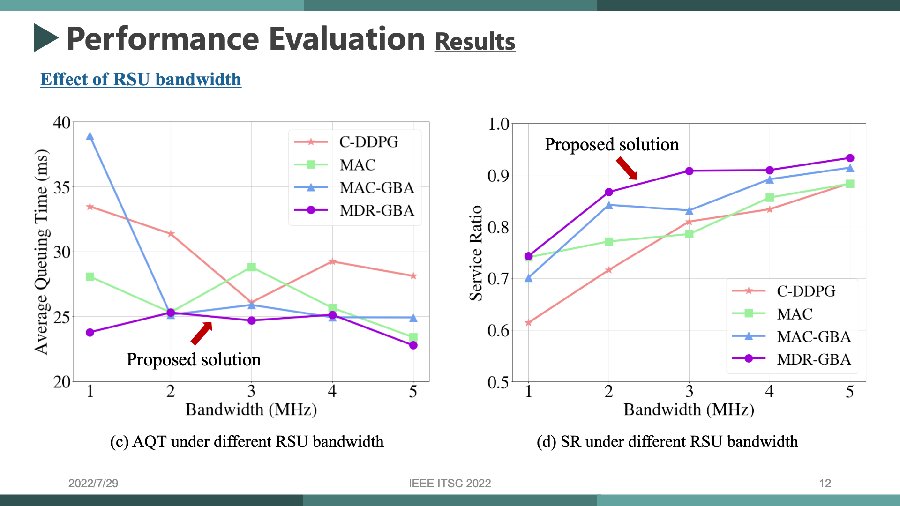

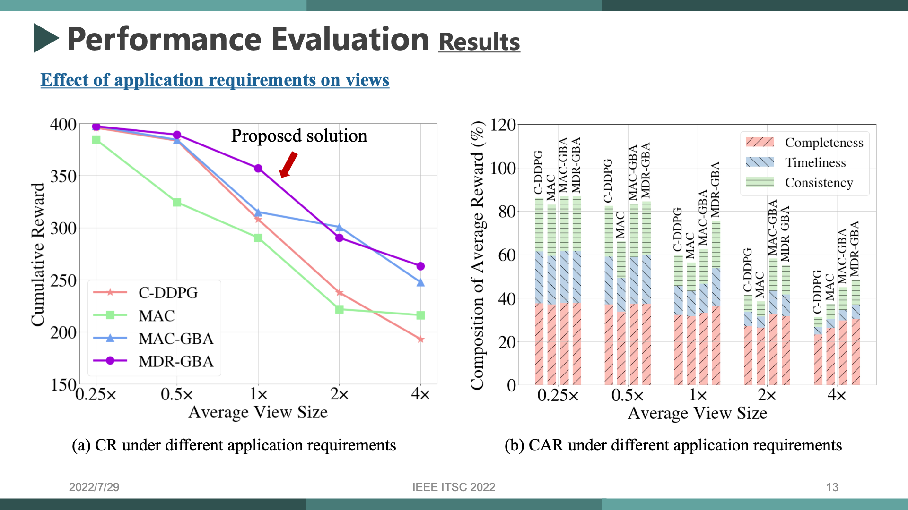

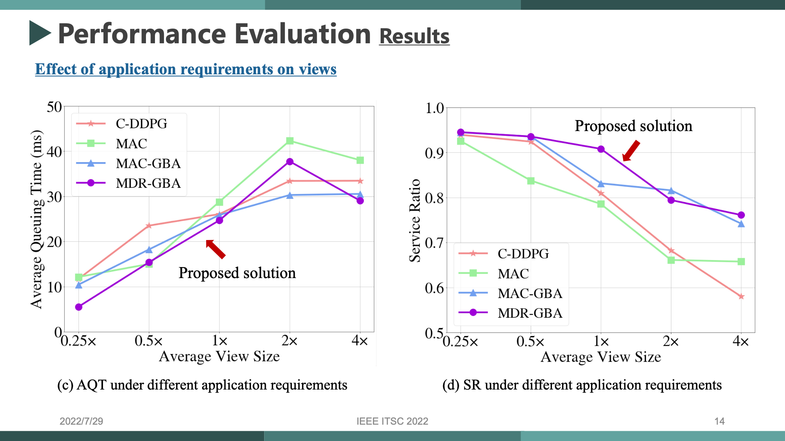

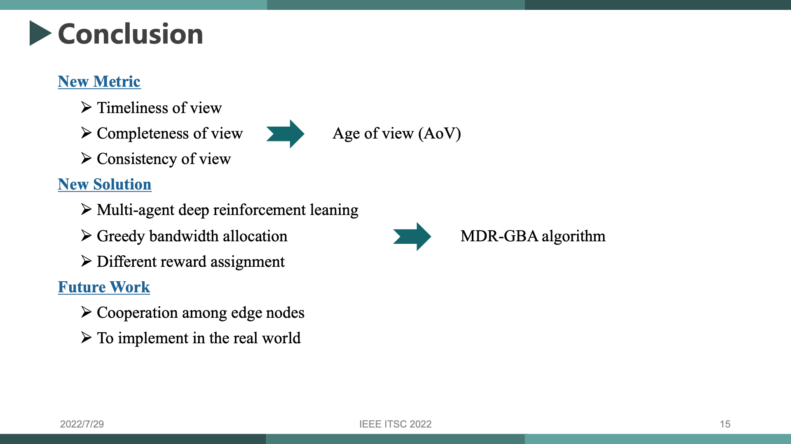

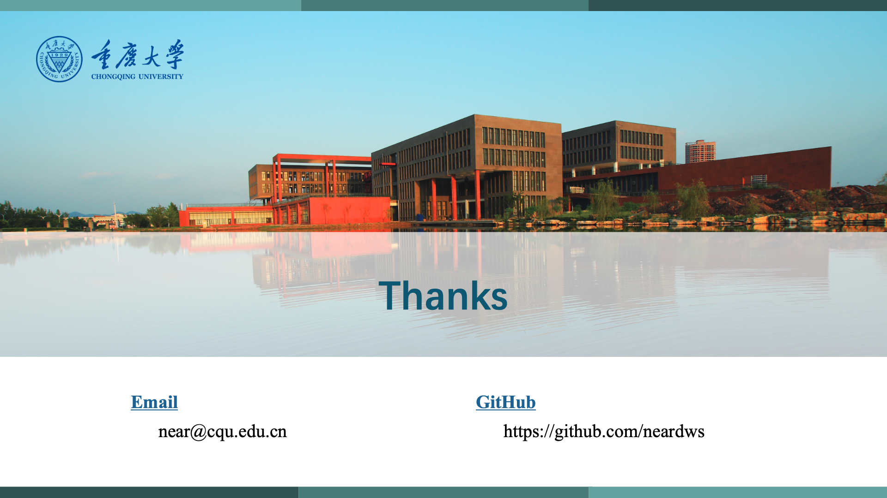

## Citing this paper

```bibtex
@inproceedings{xu2022age,
  title={Age of view: A new metric for evaluating heterogeneous information fusion in vehicular cyber-physical systems},
  author={Xu, Xincao and Liu, Kai and Zhang, Qisen and Jiang, Hao and Xiao, Ke and Luo, Jiangtao},
  booktitle={2022 IEEE 25th International Conference on Intelligent Transportation Systems (ITSC)},
  pages={3762--3767},
  year={2022},
  organization={IEEE}
}
```
